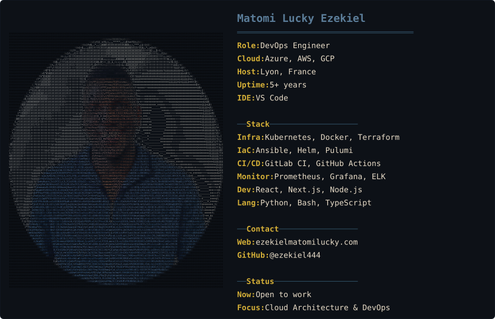

 

### Hi there 👋

I'm Matomi, a DevOps Engineer and Cloud Architect with a Full Stack development background. I design and build cloud infrastructure, CI/CD pipelines, and container orchestration systems across Azure, AWS, and GCP. I also build web applications when the project calls for it.

Previously a Full Stack JavaScript developer, I transitioned into cloud and DevOps after completing my Master's in Systems, Networks & Cloud Computing. I still enjoy mentoring developers (Code Your Future SA, 2021) and believe in learning by building.

**Motto:** That that you do the most, will be that that you do the best. 💪

- 🔭 Currently consulting on cloud infrastructure (Azure & AWS)
- ☁️ Building Hub & Spoke architectures, service meshes, monitoring stacks
- 👯 Would love to collaborate on DevOps, cloud, or web projects
- 🌱 On a never-ending quest for learning
- 📍 Based in Lyon, France
- 📫 Find me at [ezekielmatomilucky.com](https://ezekielmatomilucky.com)
- ⚽ Fun fact: I'm a footballer, been playing since childhood

 

### What I Do

☁️ **Cloud Architecture** — Azure, AWS, GCP solutions, Hub & Spoke infra

🔄 **DevOps & CI/CD** — Kubernetes, Docker, Terraform, Ansible, GitLab/GitHub pipelines

💻 **Full Stack Development** — React, Next.js, Node.js, Python

👨‍🏫 **Mentorship** — Teaching, team leadership, code tutoring

 

### Dashboard

 

 

 

### Tech

  
  
  
  
  
  
  
  
  
  
  
  
  
  
  

 

  ⭐ From <a href="https://github.com/matomitw">@Matomi Lucky Ezekiel</a>

